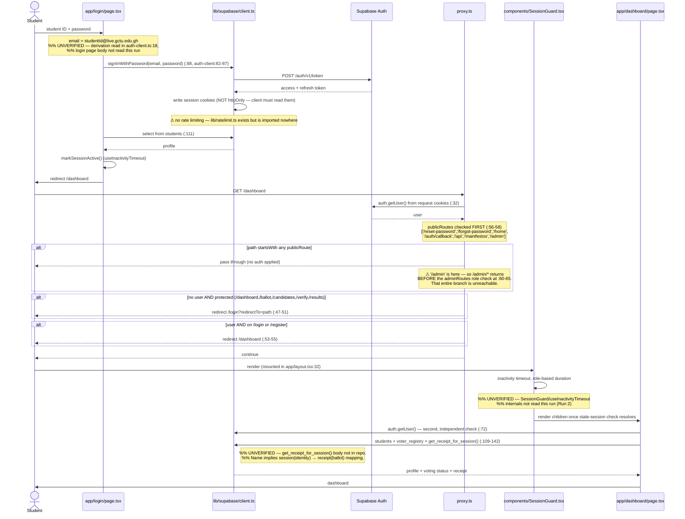

# GT-Vote — 01 ARCHITECTURE (Run 1: Recon)

> Companion to `00_INVENTORY.md`. Evidence tags: `[CONFIRMED]` read in code ·
> `[INFERRED]` implied by naming/imports · `[ASSUMED]` framework default ·
> `[UNKNOWN]` could not determine.

---

## 1. Rendering and execution model

### The shape of it

**GT-Vote is a client-rendered SPA wearing an App Router costume.** `[CONFIRMED]`

Every one of the 15 route pages carries `'use client'` — including all five admin pages.
`[CONFIRMED — directive scan across all .tsx]` The only server-side code in the entire
application is:

| Kind | Count | Files |
|---|---|---|
| Server components | 4 | `app/layout.tsx`, `app/page.tsx`, `components/PageBackground.tsx`, `components/theme-provider.tsx` |
| Route handlers | 5 | `app/api/{stats,admin/verify,send-reminders,send-vote-confirmation}/route.ts`, `app/auth/callback/route.ts` |
| Middleware | 1 | `proxy.ts` |
| **Server actions** | **0** | — `[CONFIRMED: no `'use server'` anywhere]` |

`app/layout.tsx:26-33` mounts `SessionGuard` around all children, so a client component
wraps the whole tree from the root down. `[CONFIRMED]`

### Where the trust boundary sits

```
  BROWSER (untrusted)                    │  SERVER (trusted)
  ───────────────────────────────────────┼──────────────────────────────
  15 client pages                        │  proxy.ts (route guards)
  anon key, RLS-enforced                 │  5 route handlers
  ├─ direct table reads/writes           │  ├─ /api/stats — SERVICE ROLE
  ├─ submit_vote / verify_receipt RPCs   │  └─ 3 others — session-checked
  ├─ storage uploads                     │
  ├─ hashStudentId()  ← salt lives here  │
  └─ ballot DELETE (admin settings)      │
```

The boundary is **almost entirely inside Postgres**, not inside Next.js. Next.js provides
routing, cosmetic guards, and four narrow server endpoints; every meaningful
authorisation decision is an RLS policy that **does not exist in this repository**
(`00_INVENTORY.md` Finding 0). `[CONFIRMED for the app side; [UNKNOWN] for the policies]`

---

## 2. Data access pattern — *the* architectural fact

**The app queries Supabase directly from the browser with the anon key and relies on RLS.
Server-side data access is the exception, not the rule.** `[CONFIRMED]`

Evidence — 18 of the 20 `createClient()` call sites are in `'use client'` files:

| Surface | File:line | Runs in |
|---|---|---|
| Ballot: read `students`, `voter_registry`, `candidates`; call `submit_vote` | `app/ballot/page.tsx:70,80,95,190` | **browser** |
| Results: read `ballots` + `candidates` | `app/results/page.tsx:71,76` | **browser** |
| Admin tally: read `ballots`, `students`, `voter_registry` | `app/admin/dashboard/page.tsx:51,56,127` | **browser** |
| Admin candidate CRUD + storage upload | `app/admin/candidates/page.tsx:138-269` | **browser** |
| **Admin election reset: `DELETE FROM ballots`, reset `voter_registry`** | `app/admin/settings/page.tsx:124-125` | **browser** |
| Admin voter roll: `students` + `voter_registry` | `app/admin/voters/page.tsx:39,45` | **browser** |
| Registration: INSERT `students` **and** `voter_registry` | `lib/auth-client.ts:64,77` | **browser** |
| Public stats aggregation | `app/api/stats/route.ts:34-44` | server (service role) |
| Reminder recipient selection | `app/api/send-reminders/route.ts:95,108` | server (anon + session) |

Three consequences worth stating plainly:

1. **Election destruction is a client-side capability.** `app/admin/settings/page.tsx:124-125`
   issues `.from('ballots').delete().neq('id', ...)` from the browser. Anyone holding an
   anon key and a session that RLS accepts as admin can wipe the election. `[CONFIRMED]`
2. **Ballot rows are readable by browser code** (`app/results/page.tsx:76`,
   `app/admin/dashboard/page.tsx:127`). Whether that read is scoped is `[UNKNOWN]` — it
   depends on RLS.
3. **No typed schema.** No generated types file, so every query is `any`-shaped and a
   column rename fails silently at runtime. `[CONFIRMED]`

---

## 3. Auth model

**Supabase Auth** (email + password), not custom. `[CONFIRMED]`

- **Identity shim:** students never supply an email. `lib/auth-client.ts:18` synthesises
  `${studentId.toLowerCase()}@live.gctu.edu.gh`. Student ID *is* the credential.
  `[CONFIRMED]`
- **Signup metadata:** `student_id`, `full_name`, `faculty`, `level`, and
  `student_id_hash` are written into `auth.users.user_metadata` at signup
  (`lib/auth-client.ts:28-34`). **User metadata is client-writable in Supabase** — Run 2
  should check whether anything trusts it. `[CONFIRMED it is written; [UNKNOWN] whether trusted]`
- **Receipt storage:** `saveReceiptToSession` writes `receipt_code` into user metadata
  (`lib/auth-client.ts:89-93`) — **this attaches a ballot receipt to the authenticated
  identity.** See §4. `[CONFIRMED]`

### Session reading — three different places, three configurations

| Location | Mechanism | Cookie flags |
|---|---|---|
| `proxy.ts:32` | `supabase.auth.getUser()` | Supabase defaults — **`httpOnly` deliberately NOT set** (`:17-21`) so `document.cookie` stays readable |
| `lib/supabase/server.ts:20-27` | cookie store | **forces `httpOnly: true`**, `maxAge: 86400`, `sameSite: 'lax'` |
| `lib/supabase/client.ts` | `document.cookie` | n/a |

`proxy.ts` and `lib/supabase/server.ts` set **contradictory `httpOnly` values for the same
cookies**. Which wins depends on request ordering. `[CONFIRMED — both files read]`
Because the browser client must read the session, session tokens are **XSS-readable by
design**, and the CSP allows `'unsafe-inline'` and `'unsafe-eval'`
(`next.config.js:44-45`). `[CONFIRMED]`

### Role determination — admin vs voter

Admin is `user.app_metadata.role === 'admin'` (`app_metadata`, correctly, is not
client-writable). Checked in three places: `[CONFIRMED]`

| Where | File:line | Effective? |
|---|---|---|
| Proxy guard | `proxy.ts:60-65` | **NO — unreachable.** `'/admin'` is in `publicRoutes` (`:52`) and the early return at `:56-58` fires first |
| Admin login page | `app/admin/page.tsx:76-84` | Client-side only — cosmetic |
| `/api/send-reminders` | `route.ts:65-68` | **Yes — real server-side check** |

Admin login is a three-factor ritual (`app/admin/page.tsx:46-88`): POST the
`ADMIN_SECRET_KEY` to `/api/admin/verify`, then `signInWithPassword`, then the client-side
role check, then `sessionStorage.setItem('admin_auth', 'true')`. The secret-key compare is
`secretKey !== validKey` — **not constant-time and not rate-limited**
(`app/api/admin/verify/route.ts:9`). `[CONFIRMED]`

Since the proxy guard is unreachable and the page check is client-side, **the only real
defence on admin *data* is RLS.** `[CONFIRMED for the app layer; [UNKNOWN] for RLS]`

---

## 4. The identity / ballot boundary

The stated design: identity and ballot are decoupled by salted SHA-256; no join between
`voter_registry` and `ballots`.

| IDENTITY side | PARTICIPATION side (the seam) | BALLOT side |
|---|---|---|
| `students` (`student_id`, `full_name`, `email`, `faculty`, `level`) | `voter_registry` (`student_id_hash`, `has_voted`, `voted_at`) | `ballots` |
| `auth.users` (email derived from student ID) | | `candidates` |

### Files on each side

- **Identity only:** `app/login/page.tsx`, `app/register/page.tsx`,
  `app/forgot-password/page.tsx`, `app/reset-password/page.tsx`, `lib/auth-server.ts` (dead)
- **Ballot only:** `app/results/page.tsx`
- **The hash function itself:** `lib/auth.ts` — the entire boundary rests on these 13 lines

### Modules that touch BOTH sides — the crossings that matter

| Module | What it does | Assessment |
|---|---|---|
| `app/ballot/page.tsx:70-95,175-200` | Reads `students.student_id` (identity) → hashes in-browser → reads `voter_registry` → calls `submit_vote(hash, votes)` | **The critical crossing.** Identity and ballot are in the same JS scope at `:188-193`. Separation depends entirely on `submit_vote()` not persisting the hash beside the vote — `[UNKNOWN]`, body not in repo |
| `lib/auth-client.ts:60-80` | Registration inserts `students` then `voter_registry` back-to-back from the browser | Two inserts, no transaction. A failure between them orphans a student with no registry row |
| `app/api/send-reminders/route.ts:104-120` | Reads all `students.student_id`, re-hashes each, diffs against `voter_registry` to find non-voters | **Server-side de-anonymisation of participation, by design.** Comment at `:104-105` acknowledges it. Reads no ballot content — the boundary holds, but it proves hash→name is trivially reversible given the salt |
| `app/admin/voters/page.tsx:39-45` | Lists `students` beside `voter_registry` in the browser | Admin can see who voted (not what) |
| `app/dashboard/page.tsx:109-142` | Reads `students`, `voter_registry`, then `get_receipt_for_session()` | **`get_receipt_for_session` maps an authenticated session to a ballot receipt.** If that receipt reaches the ballot row, it is a direct identity→ballot join. Body `[UNKNOWN]` — top Run 2 priority |
| `lib/auth-client.ts:89-93` | Writes `receipt_code` into `auth.users` user metadata | **Persists a ballot handle on the identity record.** Combined with `verify_receipt`, this may reconstitute the join the design forbids |
| `seed-votes.js:49-109` | Reads real `students`, hashes, votes via the real RPC | Service-role; can pollute production |

### Verdict on the design claim

The *table* design does appear to avoid a foreign key — `voter_registry` holds a hash, not
a student ID, and `submit_vote` takes the hash rather than a user ID. `[INFERRED from call
signatures at `app/ballot/page.tsx:190-193`; DDL not available]`

But two things weaken it materially:

1. **The salt is not secret** (`00_INVENTORY.md` Finding 1). Hashing runs in the browser,
   so the salt must be shipped there; it resolves to a public var or the literal
   `'gt-vote-2025'`. With an enumerable student-ID space, `hash → student` is a lookup
   table. `send-reminders` performs exactly that reversal in production code. **The hash
   obscures nothing from anyone who can read `voter_registry`.** `[CONFIRMED]`
2. **`get_receipt_for_session()` and the receipt-in-user-metadata pattern** create a
   session→receipt link. Whether receipt→ballot exists is `[UNKNOWN]`, but if it does, the
   "no join" property is defeated through the receipt rather than the hash. `[CONFIRMED
   that the link is created; [UNKNOWN] where it terminates]`

---

## 5. External services

| Service | Purpose | Where | Notes |
|---|---|---|---|
| **Supabase** | Postgres, Auth, RLS, Storage | throughout | Buckets `candidate-photos`, `candidate-manifestos` written from the browser (`app/admin/candidates/page.tsx:138-170`) |
| **Brevo (SMTP)** | Transactional email via nodemailer | `app/api/send-vote-confirmation`, `app/api/send-reminders` | 6 `BREVO_*` env vars, **none in `.env.example`** |
| **Vercel** | Hosting, `lhr1` | `vercel.json` | In-memory rate limiter would be per-instance (moot — it's unwired) |
| **Google Fonts** | Inter | `app/layout.tsx:16` | Allowed in CSP `style-src`/`font-src` |

No analytics, no SMS, no error tracking (Sentry etc.), no logging service. Errors go to
`console.error` only. `[CONFIRMED]`

---

## 6. System architecture

```mermaid
flowchart TB
    subgraph browser["BROWSER — untrusted, anon key"]
        direction TB
        pub["app/home/page.tsx<br/>public landing"]
        auth["app/login · register<br/>forgot/reset-password"]
        vote["app/ballot/page.tsx<br/>★ casts the vote"]
        dash["app/dashboard/page.tsx"]
        res["app/results · verify<br/>candidates"]
        adm["app/admin/*<br/>5 client pages"]
        guard["components/SessionGuard.tsx<br/>lib/useInactivityTimeout.ts"]
        hash["lib/auth.ts<br/>hashStudentId — SALT SHIPPED HERE"]
        cli["lib/supabase/client.ts<br/>createBrowserClient"]
    end

    subgraph edge["NEXT.JS SERVER"]
        proxy["proxy.ts<br/>route guards<br/>admin branch UNREACHABLE"]
        srv["lib/supabase/server.ts<br/>cookie client"]
        cb["app/auth/callback/route.ts"]
        stats["app/api/stats/route.ts<br/>SERVICE ROLE · no auth"]
        akey["app/api/admin/verify/route.ts<br/>ADMIN_SECRET_KEY"]
        conf["app/api/send-vote-confirmation"]
        rem["app/api/send-reminders<br/>★ re-hashes identities"]
    end

    subgraph sb["SUPABASE — RLS not in repo"]
        direction TB
        sbauth["auth.users<br/>email = studentId@live.gctu.edu.gh"]
        students["students<br/>IDENTITY"]
        registry["voter_registry<br/>student_id_hash · has_voted"]
        ballots["ballots<br/>BALLOT"]
        cands["candidates"]
        settings["election_settings"]
        rpc["submit_vote · verify_receipt<br/>get_receipt_for_session<br/>BODIES NOT IN REPO"]
        store["storage: candidate-photos<br/>candidate-manifestos"]
    end

    brevo["Brevo SMTP<br/>nodemailer"]

    pub --> stats
    auth --> cli
    vote --> hash --> cli
    dash --> cli
    res --> cli
    adm --> cli
    adm --> akey
    adm --> rem
    guard -.-> cli
    vote --> conf

    cli --> sbauth
    cli --> students
    cli --> registry
    cli --> ballots
    cli --> cands
    cli --> settings
    cli --> rpc
    adm --> store

    proxy --> sbauth
    cb --> srv --> sbauth
    stats --> students
    stats --> registry
    rem --> students
    rem --> registry
    conf --> brevo
    rem --> brevo

    rpc --> registry
    rpc --> ballots

    style hash fill:#7f1d1d,color:#fff
    style stats fill:#7f1d1d,color:#fff
    style proxy fill:#7f1d1d,color:#fff
    style rpc fill:#78350f,color:#fff
    style vote fill:#1e3a5f,color:#fff
    style rem fill:#78350f,color:#fff
```



---

## 7. Sequence — cast a vote

```mermaid
sequenceDiagram
    actor V as Voter
    participant B as app/ballot/page.tsx
    participant H as lib/auth.ts
    participant C as lib/supabase/client.ts
    participant DB as Supabase (RLS)
    participant RPC as submit_vote()
    participant API as /api/send-vote-confirmation
    participant M as Brevo SMTP

    V->>B: navigate /ballot
    Note over B: proxy.ts allows: /ballot is in protectedRoutes,<br/>user present → passes (:47-51)

    B->>C: auth.getUser()  (:64)
    C->>DB: verify session
    DB-->>B: authUser or null
    alt no user
        B->>V: navigateTo('/login')  (:65)
    end

    B->>DB: select full_name, student_id from students (:69-73)
    DB-->>B: profile
    Note right of DB: %% UNVERIFIED — RLS policy on students unknown

    B->>H: hashStudentId(profile.student_id)  (:79)
    Note over H: salt = HASH_SALT (undefined in browser)<br/>|| NEXT_PUBLIC_HASH_SALT || 'gt-vote-2025'<br/>SHA-256(salt + ID.toUpperCase().trim())
    H-->>B: hash

    B->>DB: select has_voted from voter_registry where hash (:80-84)
    DB-->>B: registry row
    Note right of DB: %% UNVERIFIED — RLS on voter_registry unknown;<br/>%% can any authed user read any hash's row?
    alt already voted
        B->>V: navigateTo('/dashboard')  (:86)
    end
    Note over B: ⚠ eligibility checked CLIENT-SIDE only.<br/>Real enforcement must be inside submit_vote(). %% UNVERIFIED

    B->>DB: select candidates order by position (:94-97)
    DB-->>B: candidate rows
    V->>B: select one candidate per position, Review, Submit

    B->>H: hashStudentId(user.studentId)  (:188)
    H-->>B: hash
    B->>DB: rpc submit_vote(p_student_id_hash, p_votes) (:190-193)
    DB->>RPC: execute
    Note over RPC: %% UNVERIFIED — function body NOT IN REPO.<br/>%% Cannot confirm: SELECT FOR UPDATE / atomicity,<br/>%% has_voted flip, ballot insert, receipt generation,<br/>%% or that the hash is not stored beside the vote.
    RPC-->>B: receipt code, or error containing 'ALREADY_VOTED' (:196)

    B->>DB: auth.updateUser({ data: { receipt_code } }) (auth-client:89-93)
    Note right of DB: ⚠ writes the ballot receipt onto the IDENTITY record
    B->>B: sessionStorage.setItem('gt_receipt', receipt) (:206)

    B-)API: POST (fire-and-forget, .catch(()=>{})) (:208)
    API->>DB: auth.getUser() — email from session, not client (:13-16)
    API->>DB: select email_receipts from election_settings (:19-23)
    alt receipts enabled
        API->>M: sendMail — no receipt code, no candidate, no position (:57-62)
    end

    B->>V: success screen + receipt code (:211-213)
    B->>V: after 4.5s → /dashboard?voted=true (:214)
```

**Unverifiable core:** the three steps that actually make this election sound — atomic
double-vote prevention, ballot/identity separation at write time, and receipt generation —
all live inside `submit_vote()`, which is not in this repository.

---

## 8. Sequence — login → session → protected route



---

## 9. Architectural risk summary

| # | Risk | Evidence | Severity |
|---|---|---|---|
| 1 | RLS + all RPC bodies absent from repo — security model unreviewable and unversioned | no `supabase/`, no `.sql` `[CONFIRMED]` | **Critical** |
| 2 | Hash salt public / hardcoded; hashing in browser; hash→identity trivially reversible | `lib/auth.ts:6-8`, `send-reminders:104-120` `[CONFIRMED]` | **Critical** |
| 3 | `proxy.ts` admin guard unreachable — `/admin` in `publicRoutes` short-circuits | `proxy.ts:52,56-58,60-65` `[CONFIRMED]` | **Critical** |
| 4 | Election reset (delete all ballots) executable from browser | `app/admin/settings/page.tsx:124-125` `[CONFIRMED]` | **Critical** |
| 5 | Receipt written onto identity record + `get_receipt_for_session()` may reconstitute the forbidden join | `lib/auth-client.ts:89-93`, `dashboard:142` `[CONFIRMED written; [UNKNOWN] terminus]` | **High** |
| 6 | Vote eligibility checked client-side; enforcement assumed in unreviewable RPC | `app/ballot/page.tsx:79-86` `[CONFIRMED]` | **High** |
| 7 | Session cookies not `httpOnly` by design + CSP allows `unsafe-inline`/`unsafe-eval` | `proxy.ts:17-21`, `next.config.js:44-45` `[CONFIRMED]` | **High** |
| 8 | Contradictory cookie flags between `proxy.ts` and `lib/supabase/server.ts` | both files `[CONFIRMED]` | Medium |
| 9 | Rate limiting and input sanitisation written but wired to nothing | `lib/ratelimit.ts`, `lib/sanitize.ts` `[CONFIRMED]` | **High** |
| 10 | `/api/stats` uses service role with no auth and no rate limit | `app/api/stats/route.ts:12-29` `[CONFIRMED]` | Medium |
| 11 | Non-constant-time admin key compare, unthrottled | `app/api/admin/verify/route.ts:9` `[CONFIRMED]` | Medium |
| 12 | Zero tests on a voting system | `package.json:5-10` `[CONFIRMED]` | **High** |
| 13 | `seed-votes.js` / `cleanup.js` can hit production with service role | `[CONFIRMED]` | Medium |
| 14 | Dead `lib/store.ts` ships plaintext creds + real student names | `lib/store.ts:7-11` `[CONFIRMED]` | Medium |
| 15 | No generated DB types — every query untyped | `[CONFIRMED]` | Medium |

---

*Run 1 · Phase B complete. Queue in `STATE.md`.*
